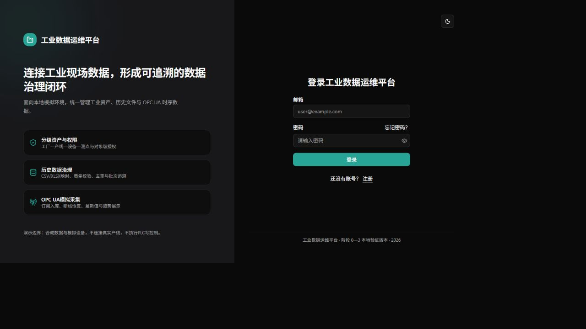
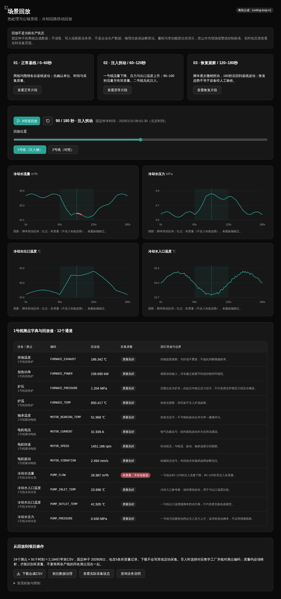

# Industrial DataOps Platform

工业数据运维与治理平台，提供资产管理、历史文件导入、OPC UA 模拟采集和带业务查询能力的 AI 助手。

基于 [FastAPI 官方全栈模板](https://github.com/fastapi/full-stack-fastapi-template) 二次开发。保留上游认证和全栈脚手架，新增工业资产域、工厂级权限、数据治理、采集与问答模块。当前用于本地开发和演示，未接入真实产线。

[](https://github.com/Jian-dong-Ming/industrial-dataops-showcase/actions/workflows/test-backend.yml)
[](https://github.com/Jian-dong-Ming/industrial-dataops-showcase/actions/workflows/test-docker-compose.yml)

## 功能

| 模块 | 已实现内容 |
| --- | --- |
| 资产与权限 | 工厂、产线、设备、测点四层模型；三角色 RBAC；用户与工厂对象级授权；禁用与重新启用 |
| 文件治理 | CSV/XLSX 宽窄表映射；测点关联；类型、量程、重复及质量码校验；批次追溯与问题导出 |
| 后台导入 | 持久化任务、进度查询、幂等提交、有限重试；进程中断后的事务回滚与任务恢复 |
| OPC UA | 两条模拟产线、六台设备、24 个测点；节点映射、订阅、批量入库、断线重连与任务启停 |
| 数据查询 | 测点最新值、趋势、采集计数和带资产名称的只读数据库视图 |
| 场景回放 | 两线24点、正常/扰动/恢复、独立坏质量事件；固定种子及CSV哈希；不改写实际采集数据 |
| AI 助手 | 文档分块与版本管理；BM25/向量混合检索；来源引用；七个只读业务工具；权限复核与失败降级 |
| 容量管理 | 数据库容量统计和有界数据保留预览；预览不执行归档或删除 |



### 业务数据如何呈现

下面是实际运行页面的合成场景区域截图，不是设计效果图。异常侧、对照侧、质量标记和恢复时间由固定脚本定义，不代表真实企业故障或算法预测成果。



回放固定为91帧×24点=2184条记录，含5条坏质量；日常最新值则来自授权数据库，停止采集后明确显示为历史保存值。两者不会为了展示效果混在一起。[完整复现与来源边界](./docs/demo-scenario.md)。

## 数据流与进程

历史文件经字段映射和质量检查后，由独立导入进程写入 PostgreSQL；OPC UA 采集进程将模拟数据写入同一套样本模型。Web 服务负责管理接口、查询与页面，AI 助手通过受限工具读取业务数据和知识文档，不执行任意 SQL 或设备控制。

| 服务 | 职责 |
| --- | --- |
| `backend` | FastAPI API、React 页面与 AI 请求处理 |
| `import-worker` | 消费持久化导入任务，与 Web 请求生命周期分离 |
| `opcua-collector` | 管理采集连接、订阅队列和批量写入 |
| `opcua-simulator` | 生成可重复的教学数据，不代表真实工况 |
| `db` | PostgreSQL 业务库、任务状态、知识文档及向量 |

技术栈：Python 3.14、FastAPI、SQLModel/SQLAlchemy、Alembic、PostgreSQL、asyncua；React、TypeScript、Vite；pytest、Playwright、Docker Compose、GitHub Actions。AI 使用 DeepSeek 与可配置的云端向量 API，目前未使用 pgvector、LangGraph 或独立向量数据库。

## 快速启动

需要支持 Compose 的 Docker Engine 或 Docker Desktop。Windows 建议在启用 Docker Desktop 集成的 WSL 2 Linux 文件系统中运行；不要在 exFAT 工作目录安装 Bun 工作区依赖。

### 1. 配置

在仓库根目录执行，已有配置不会被覆盖：

```bash
test -f .env || cp .env.example .env
```

编辑 `.env`，替换 `SECRET_KEY`、`FIRST_SUPERUSER_PASSWORD` 和 `POSTGRES_PASSWORD`，并设置管理员邮箱。示例密码仅用于开发，不应用于公开部署。不要提交 `.env` 或 `.env.ai`。

默认导入文件保存在仓库 `data/imports`，已加入 Git 忽略规则。WSL 用户可将 `IMPORT_STORAGE_HOST_DIR` 和 `IMPORT_STORAGE_DIR` 改成同一个 `/mnt/e/...` 绝对路径，将上传文件放在 E 盘。数据库位于 Docker 命名卷，修改文件路径不会迁移数据库或 Docker 虚拟磁盘。

### 2. 构建并初始化

```bash
docker compose config --quiet
docker compose build backend
docker compose up -d --wait db mailcatcher
docker compose run --rm --no-deps backend bash scripts/prestart.sh
docker compose up -d --wait backend opcua-simulator opcua-collector import-worker
docker compose up -d adminer
```

`prestart.sh` 执行数据库迁移并创建初始管理员。已有数据库升级前请先备份；不要用 `docker compose down -v` 解决启动问题，它会删除数据卷。

### 3. 添加模拟资产

```bash
docker compose exec backend python -m app.opcua.demo_seed
bash scripts/demo-verify.sh
```

初始化脚本补充缺失的演示资产，不覆盖已有编辑，不自动启动采集任务。登录后，在采集页面选择任务并启动，观察连接状态、最新值与计数。演示结束后停止任务，避免模拟样本持续占用磁盘。

如果只想先看业务过程，不必启动采集：登录后进入“场景回放”，依次查看正常、异常、恢复，再比较二号线。下载CSV不会自动入库；若练习导入，必须映射quality_code才能识别场景中的5条坏质量。

| 地址 | 用途 |
| --- | --- |
| <http://localhost:8200/> | 平台页面 |
| <http://localhost:8200/docs> | API 文档与接口调试 |
| <http://localhost:8180/> | Adminer 数据库管理；服务器填写 `db` |
| <http://localhost:1080/> | 本地测试邮件 |

### 4. 可选 AI 配置

先按 [AI 配置说明](./docs/AI_ASSISTANT.md)填写 `.env.ai`。问答模型与向量模型分别配置；模型调用可能产生费用。更新后重新创建后端容器：

```bash
docker compose up -d --force-recreate backend
```

从知识管理页面添加有实际内容的规程或说明，为对应工厂建立知识库。仅配置 API Key 不会自动生成知识。未配置 AI 服务时，资产、导入和采集功能仍可使用。

已初始化教学工厂时，也可运行`docker compose exec backend python scripts/seed-ai-demo.py --confirm`，只补充缺失的内置合成手册，不覆盖用户编辑；向量化需另外明确开启，详见场景说明。助手的自由解释仍可能不准确，不能用引用存在代替语义校验，实际计数以页面和工具证据为准。

## 开发与测试

宿主机开发另需 uv 和 Bun。在仓库根目录安装锁定依赖：

```bash
uv sync --frozen --all-groups
bun install --frozen-lockfile
```

本地 Python 命令从 `backend/` 执行。Web 服务、导入进程和采集进程是不同进程，只启动 Web 不会消费后台任务。具体配置见 [开发说明](./development.md)和[导入任务设计](./docs/IMPORT_JOBS.md)。

后端测试需要已运行的 PostgreSQL 和 Mailcatcher：

```bash
bash scripts/test-local.sh
```

该命令会重建 `TEST_DATABASE_URL` 指定的专用测试库，名称必须以 `_test` 结尾；不要在这个库保存业务数据，也不要同时运行两套使用相同测试库的测试。脚本不构建、停止或删除 Compose 服务及数据卷。`scripts/test.sh` 是同一入口的兼容别名。

不依赖数据库的测试入口检查：

```bash
uv run python -m unittest discover -s scripts/tests -v
```

测试报告默认写入 `.reports/coverage`，也可设置 `COVERAGE_HTML_DIR` 指向其他数据盘目录。

静态检查使用 `uv run prek run --all-files`。浏览器测试会创建、修改及删除测试记录，应在独立演练环境执行，不能直接对日常业务环境运行整套用例。CI 的后端、Compose 和浏览器工作流使用临时运行环境。

## 性能与验证记录

下列数据来自已记录的本机实验，并非当前提交的全量验收或生产 SLA。

| 场景 | 条件 | 结果 |
| --- | --- | --- |
| 后台 CSV 导入 | 单测点、10 万行有效合成记录；优化前后各 3 次；不启用内存跟踪 | 中位耗时 18.783 → 6.927 秒，降低 63.1% |
| 最新值查询 | 32 测点、20 万条合成记录；各 20 次热缓存查询 | 中位耗时 37.756 → 1.323 毫秒，新旧结果一致 |
| 后端测试 | 发布前源码回归，2026-09-10；Python 3.14.5 | 245 项通过、2 项付费测试跳过，语句覆盖率 92% |

导入耗时不含上传、预览和排队等待；查询耗时不是完整 HTTP 请求耗时。AI 的 26 场景记录属于回归检查，不能换算为独立问答准确率。

## 文档

- [后台导入任务与恢复](./docs/IMPORT_JOBS.md)
- [导入性能实验](./docs/IMPORT_PERFORMANCE_20260908.md)
- [OPC UA 采集设计](./docs/OPCUA.md)
- [采集状态处理](./docs/ACQUISITION_STATE_GUARD.md)
- [AI 配置与接口](./docs/AI_ASSISTANT.md)
- [AI 查询能力边界](./docs/AI_QUERY_CAPABILITIES.md)
- [验证记录与复现](./docs/VERIFICATION.md)
- [容量与保留预览](./docs/DATA_RETENTION_PREVIEWS.md)
- [架构图](./docs/architecture/README.md)
- [安全与部署边界](./SECURITY.md)

## 限制

- OPC UA 当前验证对象为内置模拟器；未完成真实设备证书、安全配置及多厂商兼容性验收。
- 导入采用整批事务；中断后重新执行任务，不是按文件偏移量断点续传。
- 向量检索在应用内计算，适用于当前小规模知识库，未验证大规模检索容量。
- 趋势工具提供有界查询，不支持任意时间范围或自动生成控制策略；AI 不负责生产决策。
- 容量预览不等于归档、清理或备份服务；尚未完成生产级可用性与灾难恢复验收。

## 来源与许可

上游基线为 `fastapi/full-stack-fastapi-template` 的 `75b402644329e53b2c9c862181b47003ad5fc914`，认证、基础用户管理和工程脚手架沿用上游。保留 [MIT License](./LICENSE)。

本仓库是独立发布的脱敏代码快照，首次提交不代表项目从零开发或全部代码原创。开发历史保留在私有仓库，公开版本不包含私人配置、企业原始资料及本地运行数据。来源与新增模块见 [NOTICE](./NOTICE.md)。
